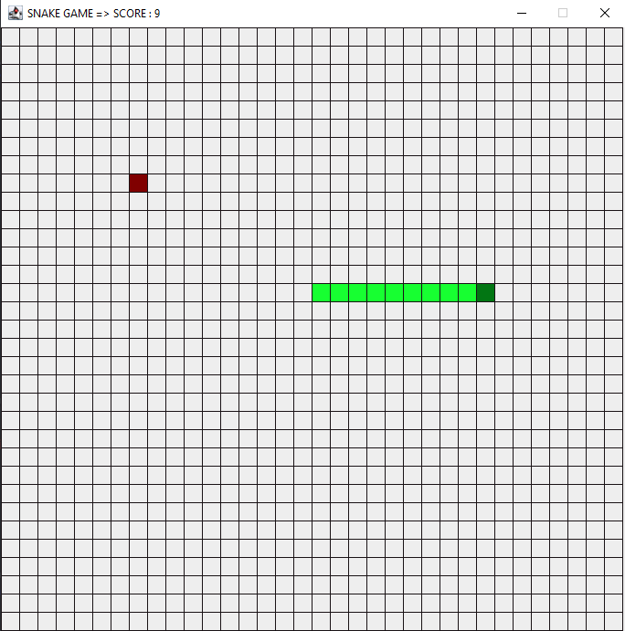
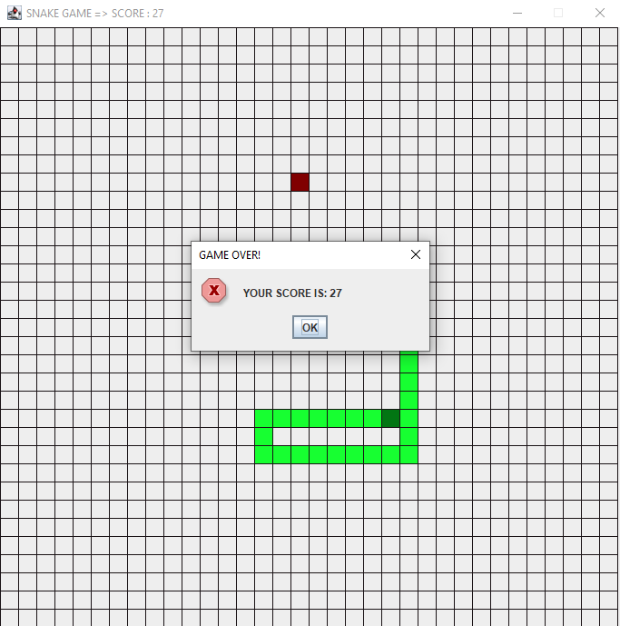

# Snake.java

- This is a very, extremely bad aproach of the traditional snake game made in Java
- Made just for fun.
- _**This could be improved in concept and implementation.**_

## CONTROLS FOR PLAY:

- This is traditional so you will use the arrows keys for moving the snake.

## SAMPLES
### Playing

### Lose

Done by:
- [@WashingtonYandun](https://github.com/WashingtonYandun)